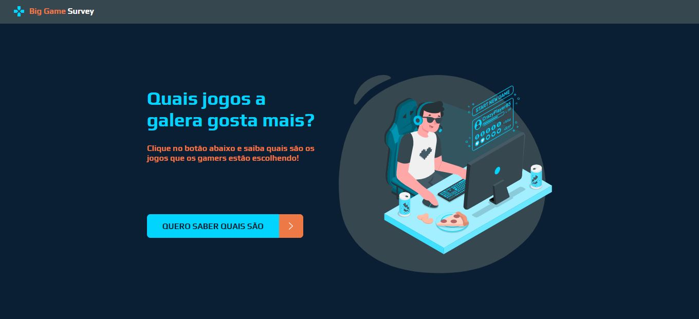
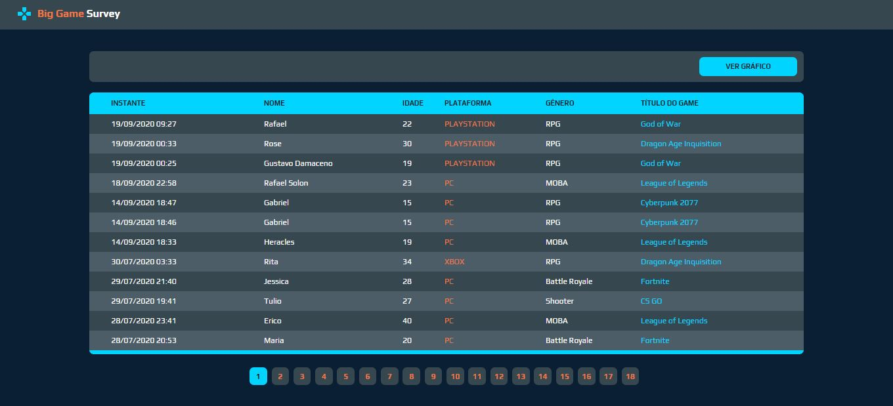
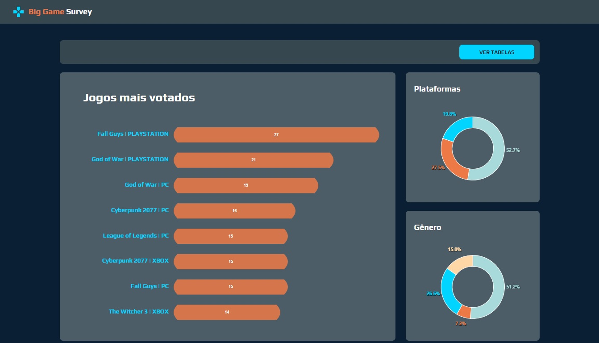

<p align="center">
  
</p>

<h3 align="center">
  Semana DevSuperior 1.0 :coffee: :seedling: :snowflake:
</h3>

<p align="center">
 <a href="#-sobre">Sobre</a> •
 <a href="#-layout">Layout</a> •
 <a href="#-tecnologias">Tecnologias</a> •
 <a href="#-autor">Autor</a> •
 <a href="#-licença">Licença</a>
</p>

## :clipboard: Visão geral
#### Qual foi a minha motivação?
Aprender de forma prática os conceitos aplicados na engenharia de software, como o Padrão de Camadas MVC, DTO, controladores REST e a arquitetura de comunicação e transferência de dados entre a API e frontEnd.
E também masterizar ainda mais as tecnologias e frameworks voltadas a Java/Spring no back, e React Typescript no Front.
#### Qual é a ideia do projeto?
<p>
Big Game Survey surgiu da ideia de criar uma forma de classificar o gosto de usuários em preferências sobre os jogos nas suas diversas plataformas. Além de um cadastro com um formulário que coleta as informações dos usuários, e listagem com paginação dos jogadores ele também gera um gráfico de tabela.
</p>

---
## 🎨 Layout

<p align="center"><strong> 🖥 WEB </strong></p>

<div align="center">
 
 
 
</div>


## 🚀 **Tecnologias**

As seguintes ferramentas foram utilizadas na construção do projeto:
#### BackEnd:
- [Java 11](https://www.java.com/pt-BR/)
- [Spring Boot](https://spring.io/)
- [PostgreSQL](https://www.postgresql.org/)
- [ReactNative](https://reactnative.dev/)

#### FrontEnd:
- [ReactJS](https://pt-br.reactjs.org/)
- [HTML5](https://developer.mozilla.org/pt-BR/docs/Web/HTML/HTML5)
- [CSS3](https://developer.mozilla.org/pt-BR/docs/Archive/CSS3)
f
## :information_source: Como usar:
To clone and run this application, you'll need [Git](https://git-scm.com), and [npm](https://www.npmjs.com/) installed on your computer. From your command line:
Para clonar e executar este aplicativo, você precisará do Git e do npm instalados no seu computador. Na linha de comando:
```bash
# Clone this repository
$ git clone https://github.com/duduxs/sds1

# Go into the repository
$ cd sds1
```

To run the API server:

```bash
# Go into the api folder
$ cd backend

# Install dependencies
$ npm i

# Run the app
$ npm run start
```

To run the frontend web:

```bash
# Go into the web folder
$ cd frontend-web

# Install dependencies
$ npm i

# Run the app
$ npm run start
```

Now access on your browser: http://localhost:3000

## 🛠 Ferramentas de suporte

- [Spring Tools Suite 4](https://spring.io/tools) - IDE de desenvolvimento de aplicações Spring.
- [Postman](https://www.postman.com/) - documentação das requisições API REST.
- [Heroku CLI](https://devcenter.heroku.com/articles/heroku-cli) - Serviço de suporte a hospedagem.
- [Visual Studio Code](https://code.visualstudio.com/) - IDE de desenvolvimento geral.

## :link: **links**


Copyright © 2020 [Gustavo Damaceno](https://github.com/gustavoddainezi).<br/>
Este projeto é licenciado pelo [MIT](./LICENSE).
